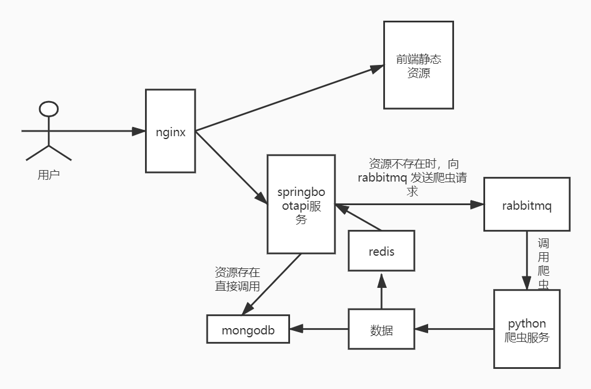
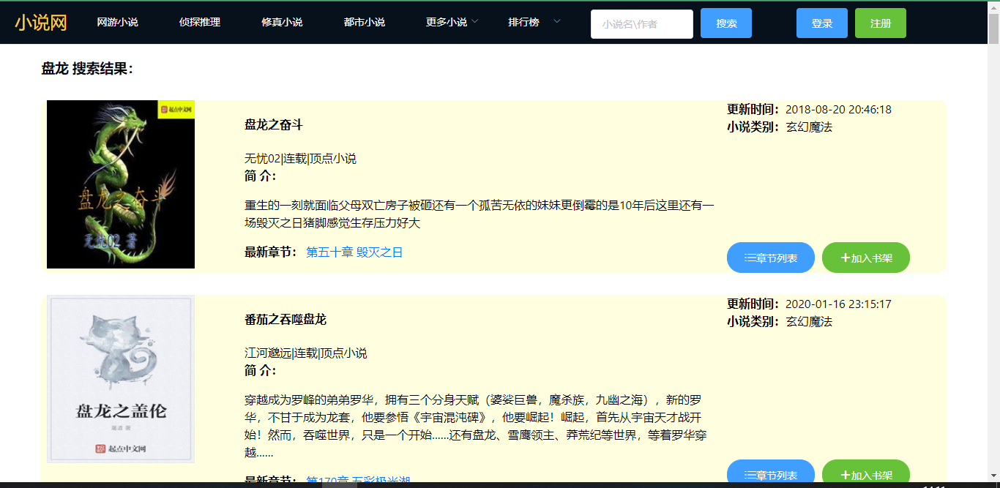
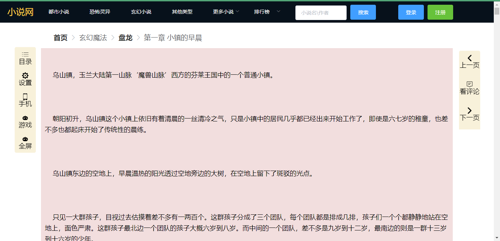
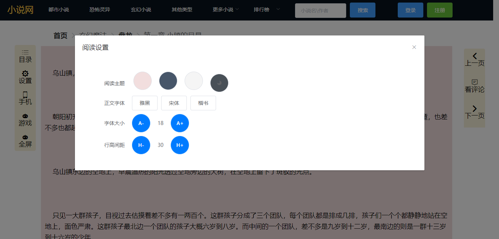

### 环境说明

>
>
>1. jdk8
>2. mysql5.7
>3. redis4
>4. rabbitmq 3.8
>5. python 3.7
>6. mongodb

### 访问地址

> http://47.102.222.205/#/

### IDE 选择

> 1. idea java代码开发
> 2. webstrom 前端开发
> 3. pychram python开发
> 4. 谷歌浏览器 调试测试

### 主要技术框架

>
>
>- 前端：
>
>  >
>  >
>  >1. vue
>  >2. vuex
>  >3. axios
>
>- 后端：
>
>  >
>  >
>  >1. springboot2.2
>  >2. swagger2
>  >3. spring-security
>  >4. mybatis
>  >5. rabbitmq
>  >6. redis
>
>- python 爬虫:
>
>  > 1. scarpy
>  > 2. xpath

### 项目结构

### 系统展示

- 展示前端

  - 首页

    

  - 搜索页

    

  - 章节页

     

  - 阅读页

    

    

  - 书架

    

- 后台管理

  

### winwdos 环境部署

- spring-boot 端口：8099
- 前端：novel-manage 端口：1113
- 前端：novel-web 端口：9527

#### 启动步骤：

>
>
>1. 本机安装启动 rabbitmq 、mongodb(两者默认开机自启)
>
>2. 虚拟机启动 redis, mysql(docker启动)，并将 虚拟机ip 在dns中设置为 dev
>
>3. 导入sql  地址：https://gitee.com/liupengss/novel/blob/master/src/main/resources/novel.sql
>
>4. 执行 git clone https://gitee.com/liupengss/novel-spider 下载python项目 进入项目
>
>5. 进入spider  命令行 执行 python test.py 启动python 服务
>
>6. 执行 git clone https://gitee.com/liupengss/novel 下载java项目  idea运行springboot项目
>
>7. 执行 git clone https://gitee.com/liupengss/novel-manage 下载novel_manage前端项目
>
>   项目根目录:
>
>   >1. npm install
>   >2. npm run dev 
>
>8. 执行 git clone https://gitee.com/liupengss/novel-web  下载novel_web前端项目
>
>   项目根目录:
>
>   >1. npm install
>   >2. npm run dev 
>
>9. http://localhost:1113/  进入前端
>10. http://localhost:9528/  进入后端管理
>11. 测试账号 admin1/123456
